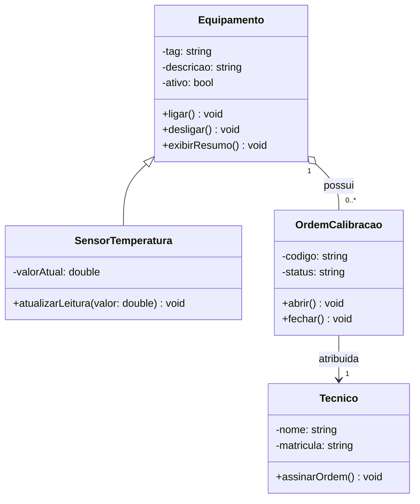

# Diagrama de Classe - Entrega do Aluno

## 1. Requisito resumido

Escreva aqui um resumo curto do problema em `5` a `8` linhas.

## 2. Link do Mermaid Live

Cole aqui o link do diagrama validado no editor online.

## 3. Diagrama final em Mermaid

## 4. Justificativa das relacoes

Explique, em frases curtas:

- por que houve generalizacao ou realizacao;
- por que houve agregacao ou composicao;
- por que a cardinalidade foi escolhida;
- por que as classes fazem sentido no dominio.

## 5. Linguagem escolhida

Marque a trilha usada:

- [ ] C++
- [ ] Python

## 6. Evidencias de execucao

Cole aqui a saida do terminal, prints ou observacoes da execucao.
